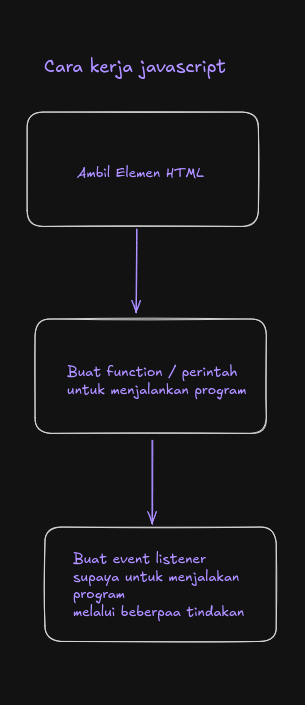
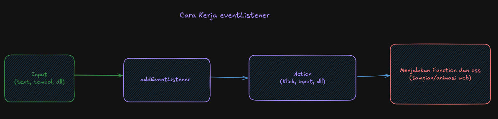

# Movie_Web
## 🏗️ Proyek Civil Calculator

### ✅ Checklist Pengembangan

- [ ] **Halaman untuk memuat data KPI project lama**  
  → Tambahkan halaman atau fitur untuk menampilkan data historis KPI dari proyek sebelumnya.

- [ ] **Tambah kolom untuk informasi proyek**  
  → Informasi yang ditambahkan:
  - No. Job
  - Alamat Proyek
  - Nama Engineer
  - Internal Checker
  - External Checker

- [ ] **Tambah kolom di bawah (Total SPET Hours)**  
  → Tambahkan baris khusus di bawah tabel untuk menjumlahkan total jam SPET dari seluruh komponen.

- [ ] **Buat hasil PDF jadi format landscape dan mencakup satu halaman**  
  → Export PDF dalam ukuran **Letter**, orientasi **Landscape**, dengan layout tabel pas di satu halaman penuh.

# Target Proyek
- [ ] **Civil Web**
- [x] **Paint App**
- [x] **Quiz App**
- [x] **Audio App**
- [x] **Typing Speed App**
- [x] **Todo List App**
- [x] **Shooping App**
- [x] **Weather App**

## Note Javascript : ****

